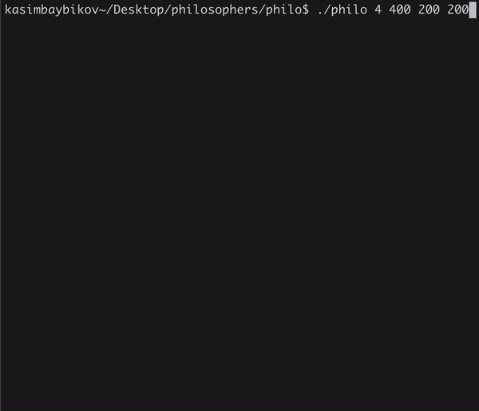

# philosophers



You can read more about the problem of dining philosophers [here](https://en.wikipedia.org/wiki/Dining_philosophers_problem)

## Rules
- One or more philosophers sit at a round table. There is a large bowl of spaghetti in the middle of the table.
- The philosophers alternatively `eat`, `think`, or `sleep`.   
While they are eating, they are not thinking nor sleeping;   
while thinking, they are not eating nor sleeping;    
and, of course, while sleeping, they are not eating nor thinking.
- There are also forks on the table. There are `as many forks as philosophers`.
- Because serving and eating spaghetti with only one fork is very inconvenient, a
philosopher takes their right and their left forks to eat, one in each hand.
- When a philosopher has finished eating, they put their forks back on the table and
start sleeping. Once awake, they start thinking again. The simulation stops when
a philosopher dies of starvation.
- Every philosopher needs to eat and should never starve.
- Philosophers don’t speak with each other.
- Philosophers don’t know if another philosopher is about to die.
- No need to say that philosophers should avoid dying!

## Parameters

Program should take the following arguments:   

- **number_of_philosophers**: The number of philosophers and also the number of forks.
- **time_to_die** (in ms): If a philosopher didn’t start eating time_to_die milliseconds since the beginning of their last meal or the beginning of the simulation, they die.
- **time_to_eat** (in ms): The time it takes for a philosopher to eat. During that time, they will need to hold two forks.
- **time_to_sleep** (in ms): The time a philosopher will spend sleeping.
- **number_of_times_each_philosopher_must_eat** (optional argument): If all philosophers have eaten at least number_of_times_each_philosopher_must_eat
times, the simulation stops.

## Usage
```bash
make
# ./philo num_of_ph time_to_die time_to_eat time_to_sleep [number_of_eat]
./philo 4 400 200 200
```
> ./philo 4 400 200 200 #should live   
> ./philo 4 20 10 11 #should die
